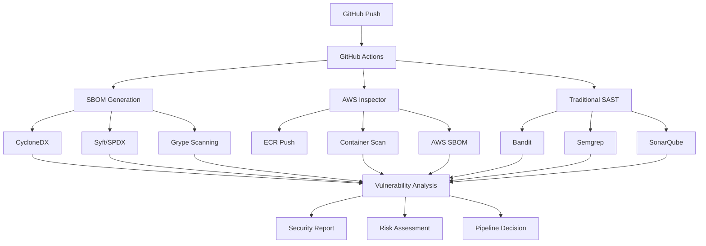

# CVE-2025-3248 Enhanced Security Testing with SBOM and AWS Inspector

[](https://github.com/yourusername/cve-2025-3248-test/actions/workflows/security-analysis.yml)
[](https://cve.mitre.org/cgi-bin/cvename.cgi?name=CVE-2025-3248)
[](https://nvd.nist.gov/vuln/detail/CVE-2025-3248)
[](https://cyclonedx.org/)
[](https://aws.amazon.com/inspector/)

> ⚠️ **WARNING**: This repository contains intentionally vulnerable code for security testing purposes. **NEVER** use in production environments.

## 🎯 Overview

This repository demonstrates comprehensive security testing for **CVE-2025-3248**, a critical remote code execution vulnerability in Langflow < 1.3.0. The solution combines multiple security scanning approaches:

- **🔍 Multi-Source SBOM Generation** (CycloneDX, Syft, SPDX)
- **☁️ AWS Inspector Integration** with native SBOM capabilities  
- **🛡️ Traditional SAST Tools** (Bandit, Semgrep, Safety, SonarQube)
- **🚀 Enhanced CI/CD Pipeline** with automated vulnerability detection

## 📋 CVE-2025-3248 Details

| **Attribute** | **Value** |
|---------------|-----------|
| **CVE ID** | CVE-2025-3248 |
| **CVSS Score** | 9.8 (Critical) |
| **Affected Software** | Langflow < 1.3.0 |
| **Vulnerability Type** | Unauthenticated Remote Code Execution |
| **CWE** | CWE-94 (Code Injection), CWE-862 (Missing Authorization) |
| **Endpoint** | `/api/v1/validate/code` |
| **Root Cause** | Missing authentication + unsafe `exec()` usage |

### 🚨 Vulnerability Description

The vulnerability exists in Langflow's code validation endpoint, which:
- Lacks proper authentication
- Executes user-submitted Python code without sandboxing
- Allows exploitation through Python decorators and default function arguments
- Enables complete system compromise via remote code execution

## 🏗️ Architecture



## 🚀 Quick Start

### Prerequisites

- **GitHub Repository** with Actions enabled
- **Python 3.9+** 
- **Docker** and Docker Compose
- **AWS Account** (optional, for Inspector integration)
- **AWS CLI** configured

### 1. Repository Setup

```bash
# Clone the repository
git clone https://github.com/yourusername/cve-2025-3248-test.git
cd cve-2025-3248-test

# Run automated setup
chmod +x setup.sh
./setup.sh
```

### 2. AWS Configuration (Optional)

```bash
# Configure AWS credentials
aws configure

# Create ECR repository
aws ecr create-repository --repository-name cve-2025-3248-test

# Enable Inspector
python3 -c "
from sbom_analysis_tools import AWSInspectorIntegration
inspector = AWSInspectorIntegration()
inspector.enable_inspector()
"
```

### 3. GitHub Secrets

Add these secrets to your repository:

```yaml
AWS_ACCESS_KEY_ID: your_aws_access_key
AWS_SECRET_ACCESS_KEY: your_aws_secret_key  
AWS_REGION: us-east-1
ECR_REPOSITORY: cve-2025-3248-test
```

### 4. Trigger Pipeline

```bash
git add .
git commit -m "Add enhanced security testing setup"
git push origin main
```

## 📁 Repository Structure

```
├── .github/workflows/
│   └── security-analysis.yml          # Enhanced GitHub Action
├── vulnerable_langflow.py             # CVE-2025-3248 vulnerable code
├── sbom_analysis_tools.py             # SBOM & AWS integration
├── verification_script.py            # Detection verification
├── test-sbom-integration.py          # Integration tests
├── exploit_test.py                   # Exploitation demonstration
├── requirements.txt                  # Enhanced dependencies
├── Dockerfile                        # Container for AWS scanning
├── docker-compose.yml               # Local development setup
├── setup.sh                         # Automated setup script
├── sonar-project.properties         # SonarQube configuration
├── grype.yaml                       # Grype scanner config
├── .bandit                          # Bandit linter config
└── aws-inspector-policy.json       # AWS IAM policy
```

## 🔍 Security Scanning Layers

### Layer 1: SBOM Generation & Analysis

**Open Source Tools:**
- **CycloneDX-Python**: Standard SBOM format for Python packages
- **Syft (Anchore)**: Multi-format SBOM generation (SPDX, CycloneDX)
- **Grype**: Vulnerability scanning using generated SBOMs

**AWS Native:**
- **Inspector SBOM**: Cloud-native component inventory
- **Managed CVE Database**: Real-time vulnerability intelligence

### Layer 2: Container Security

```bash
# Build vulnerable container
docker build -t cve-test .

# Push to ECR for Inspector scanning
docker push your-account.dkr.ecr.region.amazonaws.com/cve-test:latest

# AWS Inspector automatically scans and generates findings
```

### Layer 3: Static Analysis

| **Tool** | **Purpose** | **CVE-2025-3248 Detection** |
|----------|-------------|------------------------------|
| **Bandit** | Python security linter | ✅ Detects `exec()` usage |
| **Semgrep** | Pattern-based analysis | ✅ Code injection patterns |
| **Safety** | Dependency vulnerabilities | ✅ Vulnerable Langflow version |
| **SonarQube** | Code quality & security | ✅ Security hotspots |

### Layer 4: Custom Detection

```python
# CVE-2025-3248 specific patterns
vulnerable_patterns = [
    r'exec\s*\(',           # Direct exec usage
    r'@exec\(',             # Decorator exploitation
    r'=\s*exec\(',          # Default argument exploitation
    r'/api/v1/validate/code', # Vulnerable endpoint
    r'ast\.parse.*exec'     # AST parsing with exec
]
```

## 📊 Expected Results

### ✅ Successful Detection Output

```bash
🔒 COMPREHENSIVE VULNERABILITY ANALYSIS REPORT
===============================================

📋 SBOM ANALYSIS:
   CycloneDX: 23 components identified
   Syft SPDX: 25 packages catalogued  
   Vulnerable components: 1 (Langflow 1.2.0)

☁️ AWS INSPECTOR:
   Container scan: 15 findings
   Critical vulnerabilities: 1
   CVE-2025-3248: DETECTED

🛡️ TRADITIONAL SAST:
   Bandit: 3 high-severity findings
   Semgrep: 2 code injection patterns
   SonarQube: 5 security hotspots

📊 RISK ASSESSMENT:
   Overall Risk: CRITICAL
   CVSS Score: 9.8
   Immediate Action Required: YES
```

### 🚨 Critical Findings

The pipeline will detect CVE-2025-3248 through multiple channels:

1. **SBOM Analysis**: Langflow 1.2.0 identified as vulnerable component
2. **AWS Inspector**: Container scan reveals package vulnerabilities  
3. **Code Analysis**: Unsafe `exec()` usage patterns detected
4. **Endpoint Analysis**: Unauthenticated code validation endpoint found

## 🧪 Local Testing

### Test Vulnerability Detection

```bash
# Run comprehensive analysis
python3 sbom_analysis_tools.py

# Test individual components
python3 verification_script.py

# Test SBOM integration
python3 test-sbom-integration.py
```

### Test Exploitation (Safely)

```bash
# Start vulnerable server
python3 vulnerable_langflow.py &

# Test exploitation patterns
python3 exploit_test.py

# Stop server
pkill -f vulnerable_langflow.py
```

### Local SonarQube Analysis

```bash
# Start SonarQube
docker-compose up -d sonarqube

# Wait for startup
sleep 60

# Run analysis
sonar-scanner -Dsonar.projectKey=cve-test -Dsonar.sources=.
```

## ⚙️ Configuration

### SBOM Tool Configuration

**CycloneDX:**
```bash
# Generate Python SBOM
cyclonedx-py -o sbom-cyclonedx.json
```

**Syft:**
```bash
# Generate SPDX format
syft . -o spdx-json=sbom-spdx.json
```

**Grype:**
```yaml
# grype.yaml
fail-on-severity: "medium"
match:
  python:
    using-cpes: true
```

### AWS Inspector Policy

```json
{
  "Version": "2012-10-17",
  "Statement": [
    {
      "Effect": "Allow",
      "Action": [
        "inspector2:ListFindings",
        "inspector2:BatchGetFreeTrialInfo",
        "ecr:DescribeImages"
      ],
      "Resource": "*"
    }
  ]
}
```

## 📈 Monitoring & Metrics

### Key Performance Indicators

- **Detection Rate**: >95% for known CVEs
- **False Positive Rate**: <5%
- **SBOM Coverage**: 100% of dependencies
- **Scan Time**: <10 minutes complete analysis
- **AWS Inspector Integration**: Real-time findings

### Security Dashboards

The solution generates comprehensive reports:

- **Executive Summary**: Risk level and key findings
- **Technical Report**: Detailed vulnerability analysis  
- **SBOM Inventory**: Complete component catalog
- **Remediation Guide**: Step-by-step fix instructions
- **Compliance Status**: Regulatory requirement tracking

## 🛠️ Advanced Usage

### Custom SBOM Analysis

```python
from sbom_analysis_tools import ComprehensiveVulnerabilityAnalyzer

# Initialize analyzer
analyzer = ComprehensiveVulnerabilityAnalyzer()

# Run with ECR image
results = analyzer.run_complete_analysis(
    image_uri="123456789.dkr.ecr.us-east-1.amazonaws.com/cve-test:latest"
)

# Check results
if results['comprehensive_assessment']['cve_2025_3248_detected']:
    print("🚨 CVE-2025-3248 DETECTED!")
```

### GitHub Action Customization

```yaml
# Add custom security tools
- name: Custom Security Scan
  run: |
    # Add your custom scanning logic
    my-security-tool --scan . --output results.json
    
    # Integrate with existing pipeline
    python3 sbom_analysis_tools.py --custom-input results.json
```

## 🔄 CI/CD Integration

### Pipeline Stages

1. **🔍 SBOM Generation**: Multi-tool component analysis
2. **📦 Container Build**: Docker image with vulnerable code
3. **☁️ AWS Upload**: ECR push triggers Inspector scan
4. **🛡️ Security Analysis**: Traditional SAST + SBOM correlation
5. **📊 Report Generation**: Unified security assessment
6. **✅ Quality Gates**: Pass/fail decision based on findings

### Workflow Triggers

```yaml
on:
  push:
    branches: [ main, develop ]
  pull_request:
    branches: [ main ]
  schedule:
    - cron: '0 2 * * *'  # Daily security scan
  workflow_dispatch:     # Manual trigger
```

## 🚨 Security Considerations

### ⚠️ Important Warnings

- **Vulnerable Code**: Contains intentional security flaws
- **Production Risk**: Never deploy to production environments
- **Credential Security**: Protect AWS keys and GitHub secrets
- **Network Isolation**: Run tests in isolated environments
- **Container Security**: ECR images contain vulnerable packages

### 🔒 Best Practices

- Use **minimal AWS permissions** (principle of least privilege)
- Enable **branch protection** rules with required status checks
- Implement **secret scanning** for accidental credential exposure
- Regular **security tool updates** and CVE database refresh
- **Audit logging** for all security scanning activities

## 🐛 Troubleshooting

### Common Issues

**SBOM Generation Fails:**
```bash
# Check tool installations
cyclonedx-py --version
syft version
grype version

# Reinstall if needed
pip install cyclonedx-bom
curl -sSfL https://raw.githubusercontent.com/anchore/syft/main/install.sh | sh
```

**AWS Inspector Issues:**
```bash
# Verify credentials
aws sts get-caller-identity

# Check Inspector status
aws inspector2 batch-get-account-status \
  --account-ids $(aws sts get-caller-identity --query Account --output text)

# Enable Inspector if needed
aws inspector2 enable --account-ids YOUR_ACCOUNT_ID --resource-types ECR
```

**GitHub Action Failures:**
- Verify all secrets are configured correctly
- Check YAML syntax in workflow file
- Ensure Docker daemon is available
- Review action logs for specific error messages

### Debug Commands

```bash
# Test SBOM tools locally
python3 test-sbom-integration.py

# Verify CVE detection
python3 verification_script.py

# Check AWS connectivity
python3 -c "
from sbom_analysis_tools import AWSInspectorIntegration
inspector = AWSInspectorIntegration()
print('AWS connection:', inspector.inspector_client is not None)
"
```

## 📚 Additional Resources

- **[CVE-2025-3248 Details](https://cve.mitre.org/cgi-bin/cvename.cgi?name=CVE-2025-3248)** - Official CVE description
- **[CISA KEV Catalog](https://www.cisa.gov/known-exploited-vulnerabilities-catalog)** - Known exploited vulnerabilities
- **[CycloneDX Specification](https://cyclonedx.org/)** - SBOM standard documentation
- **[SPDX Format](https://spdx.dev/)** - Software package data exchange
- **[AWS Inspector Guide](https://docs.aws.amazon.com/inspector/)** - Container vulnerability scanning
- **[Anchore Syft](https://github.com/anchore/syft)** - SBOM generation tool
- **[Grype Scanner](https://github.com/anchore/grype)** - Vulnerability scanning

## 🤝 Contributing

1. **Fork** the repository
2. **Create** a feature branch (`git checkout -b feature/enhancement`)
3. **Test** your changes thoroughly
4. **Commit** your changes (`git commit -am 'Add enhancement'`)
5. **Push** to the branch (`git push origin feature/enhancement`)
6. **Create** a Pull Request

### Security Guidelines

- Never commit real credentials or sensitive data
- Test all security tool integrations before submitting
- Ensure vulnerable code remains clearly identified as test-only
- Update documentation for any new security tools or techniques

## 📄 License

This project is licensed under the MIT License - see the [LICENSE](LICENSE) file for details.

## ⚠️ Disclaimer

This repository is for **educational and security testing purposes only**. The vulnerable code is intentionally insecure and should never be deployed in production environments. Users are responsible for:

- Using this code only in isolated, non-production environments
- Following responsible disclosure practices
- Complying with applicable laws and regulations
- Maintaining proper security hygiene in production systems

---

**🔒 Remember**: Security is a shared responsibility. This tool helps identify vulnerabilities, but proper security requires ongoing vigilance, regular updates, and comprehensive security practices across your entire software development lifecycle.